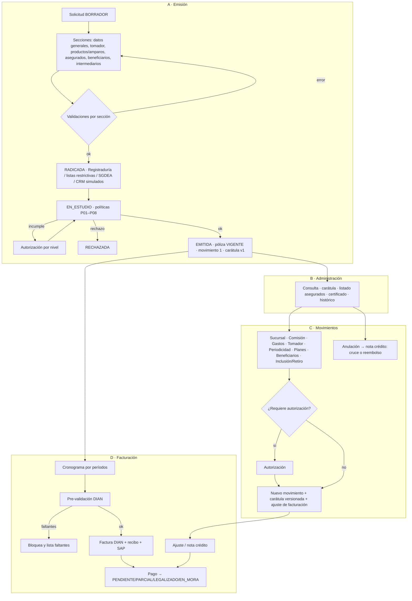

# 03 · Diagrama de flujo integral de Accidentes Personales

```mermaid
flowchart TD
  subgraph A[A · Emisión]
    A1[Solicitud BORRADOR] --> A2[Secciones: datos generales, tomador, productos/amparos, asegurados, beneficiarios, intermediarios]
    A2 --> A3{Validaciones por sección}
    A3 -- error --> A2
    A3 -- ok --> A4[RADICADA · Registraduría / listas restrictivas / SGDEA / CRM simulados]
    A4 --> A5[EN_ESTUDIO · políticas P01–P08]
    A5 -- incumple --> A6[Autorización por nivel] --> A5
    A5 -- rechazo --> A7[RECHAZADA]
    A5 -- ok --> A8[EMITIDA · póliza VIGENTE · movimiento 1 · carátula v1]
  end
  subgraph B[B · Administración]
    A8 --> B1[Consulta · carátula · listado asegurados · certificado · histórico]
  end
  subgraph C[C · Movimientos]
    B1 --> C1[Sucursal · Comisión · Gastos · Tomador · Periodicidad · Planes · Beneficiarios · Inclusión/Retiro]
    C1 --> C2{¿Requiere autorización?}
    C2 -- sí --> C3[Autorización] --> C4
    C2 -- no --> C4[Nuevo movimiento + carátula versionada + ajuste de facturación]
    B1 --> C5[Anulación → nota crédito: cruce o reembolso]
  end
  subgraph D[D · Facturación]
    A8 --> D1[Cronograma por períodos] --> D2[Pre-validación DIAN]
    D2 -- faltantes --> D3[Bloquea y lista faltantes]
    D2 -- ok --> D4[Factura DIAN + recibo + SAP]
    D4 --> D5[Pago → PENDIENTE/PARCIAL/LEGALIZADO/EN_MORA]
    C4 --> D6[Ajuste / nota crédito] --> D5
  end
```

El diagrama draw.io de HU del core está en `../FLujo core_con_HU.drawio`.

